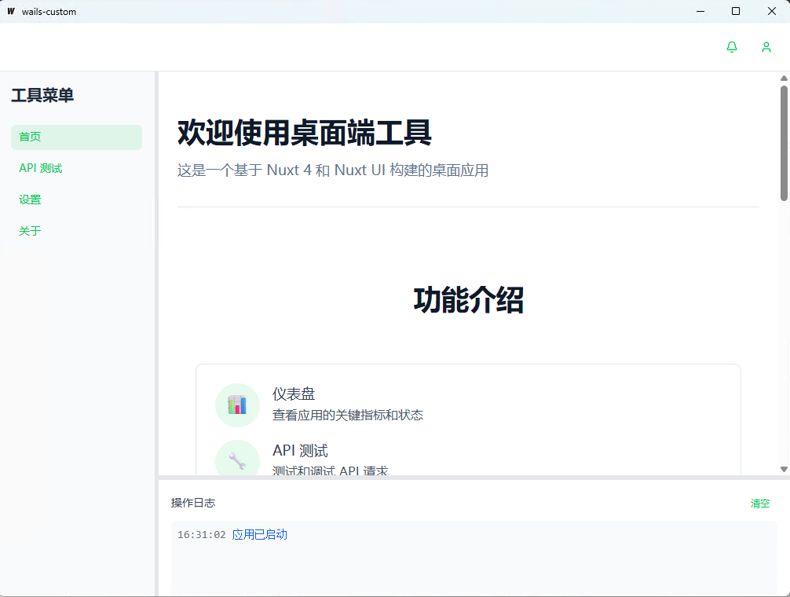
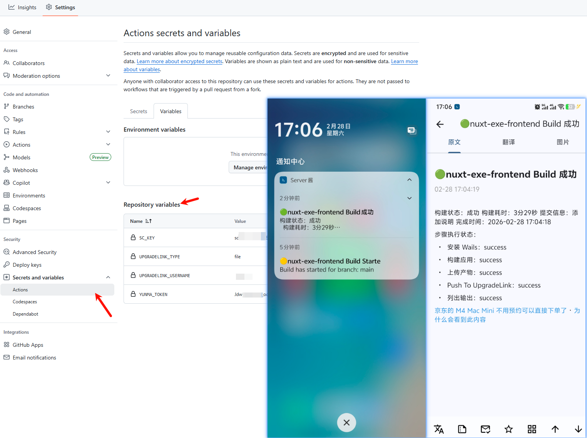

# nuxt-exe-frontend

> Reference project: https://github.com/paulbrickwell/wails-nuxt-template

[中文文档](./README.md)



## 1. Background

Solve the deployment pain points of frontend tools: package pure frontend projects into Windows platform exe executable files, allowing customers to double-click and use immediately without complex deployment.

Note: This project does not support writing backend code in Nuxt, only pure frontend code is supported. The code in server/api is only for local demonstration and cannot be used after packaging into exe.

## 2. Technology Selection

| Solution | Package Size | Portable | Config Complexity | Conclusion |
|---------|-------------|----------|------------------|------------|
| **WAILS** | Small | ✅ Supported | Simple | ✅ **Selected** |
| Tauri | Small | ❌ Installation Required | Medium | Increases customer cost |
| NW.js / Electron | Large | ❌ Not Supported | Medium | Does not meet lightweight requirements |
| pkg / nexe | - | - | - | Not tested, excluded |

**Selection Reason**: WAILS balances lightweight and portable features, suitable for Windows customer scenarios.

## 3. Features

- **Frontend to EXE**: Package completed frontend projects (compatible with Nuxt framework) into Windows platform exe executable files without complex deployment. Customers can double-click to run, greatly reducing distribution and usage barriers.

- **Integrated Distribution**: Integrated with the open-source project [UpgradeLink](https://www.toolsetlink.com/) for downloading and distributing exe files, providing convenient support for project distribution.

- **Lightweight & Portable**: Based on WAILS framework features, the packaged exe file requires no installation and can be launched by double-clicking, suitable for customer daily usage scenarios.

**Tech Stack**:

- **Frontend Framework**: Nuxt.js
- **UI Framework**: Nuxt UI

## 4. Requirements

- Go + WAILS tools: [Installation Docs](https://wails.io/)
- Node.js environment (npm/pnpm)
- Windows priority, macOS/Linux compatible

## 5. Quick Start

```bash
# Clone project
git clone https://github.com/wodepig/nuxt-exe-frontend.git
cd nuxt-exe-frontend

# Dev mode
wails dev

# Build exe
wails build

# Frontend only development
cd frontend
pnpm i
pnpm dev
```

After packaging, the exe file is located in the `build/bin` directory.

## 6. UpgradeLink Distribution



Upload the packaged exe file to the [UpgradeLink](https://www.toolsetlink.com/) open-source project, and distribute it to customers through the download link provided by the project.

### Auto Upload Configuration

The project has integrated GitHub Action auto-upload functionality. Configuration path: `Settings -> Secrets and variables -> Actions -> Repository xxx`

**Secrets:**
| Name | Description |
|------|-------------|
| `UPGRADELINK_KEY` | Unique key for the type |
| `UPGRADELINK_PWD` | Password |

**Variables:**
| Name | Description |
|------|-------------|
| `SC_KEY` | ServerChan notification key |
| `UPGRADELINK_TYPE` | Type, such as file/url/tauri |
| `UPGRADELINK_USERNAME` | UpgradeLink username |
| `YUNMA_TOKEN` | Yunma token for auto-login |

Detailed configuration reference: [Auto Upload Files](https://github.com/wodepig/upgradelink-upload-xxdl)

## 7. Project Structure

```
# Project core directory structure
├── .github/           # GitHub Action workflows
│   └── workflows/
│       └── main.yml   # Auto packaging workflow config
├── build/             # Build output directory
│   ├── README.md
│   └── appicon.png    # App icon
├── frontend/          # Frontend project (Nuxt code)
│   ├── app/           # Nuxt app core
│   │   ├── assets/    # Static assets
│   │   │   └── css/
│   │   │       └── main.css
│   │   ├── components/# Vue components
│   │   │   ├── ContentArea.vue
│   │   │   ├── LogPanel.vue
│   │   │   └── SidebarMenu.vue
│   │   ├── layout/    # Layout files
│   │   │   └── default.vue
│   │   ├── pages/     # Page routes
│   │   │   └── index.vue
│   │   └── app.vue    # App entry
│   ├── public/        # Public static assets
│   ├── server/        # Server API
│   ├── nuxt.config.ts # Nuxt config
│   ├── package.json   # Frontend dependencies
│   └── tsconfig.json  # TypeScript config
├── pngs/              # Screenshots/images
├── scripts/           # Build scripts
│   ├── build.sh
│   ├── build-windows.sh
│   ├── build-macos.sh
│   └── install-wails-cli.sh
├── app.go             # WAILS backend main program
├── main.go            # Go program entry
├── go.mod             # Go module dependencies
├── wails.json         # WAILS config
├── package.json       # Root config
└── README.md          # Documentation
```

## 8. FAQ

- Q: `wails dev/build` command error?
  A: Check if Go and WAILS tools are properly installed (verify via `go version`, `wails doctor`), and confirm frontend dependencies are installed.

- Q: Packaged exe file won't start?
  A: Ensure the packaging environment is Windows, and check if `wails.json` configuration is correct without syntax errors.

## 9. Contributing

1. Fork this repository
2. Create a new branch (`git checkout -b feature/xxx`)
3. Commit changes (`git commit -m "feat: add xxx feature"`)
4. Push to branch (`git push origin feature/xxx`)
5. Submit Pull Request and wait for review

## 10. License

MIT License © 2026 wodepig

## 11. Contact

GitHub: [https://github.com/wodepig](https://github.com/wodepig)
For questions, please leave a message via GitHub Issues.
